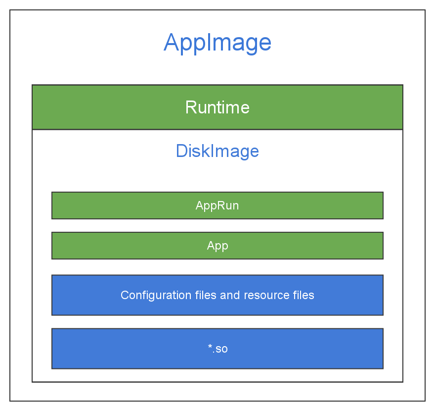

Linux apps that run anywhere Linux
==================================
####1.愿景
作为一名软件用户，期望从原作者处下载一个应用程序，可以独立运行于各种Linux桌面操作系统，就好像windows和Mac一样。
作为一名软件开发者，期望提供一种通用格式给所有的Linux桌面操作系统，不需要为每种发行版打不同的包格式。
作为一个测试工程师，期望运行多种持续集成builds来自jenkins 或者是 Travis Ci,而不需要清理我的系统。

下载一个应用程序，让它变得可执行，运行即可；无需安装，没有系统库和系统配置的影响；同时也可以运行在沙盒之中，譬如 **[Firejail](https://firejail.wordpress.com/)**。

发布你的Linux桌面应用程序基于AppImage格式，将为你赢得所有主流发行版的用户。一次打包，到处运行，直达所有主流发行版用户。

Linus Torvalds(Linux内核的发明人) 评价： “That is just very coll”.
Dirk Hohndel (英特尔开源技术总监) 评价："The AppImage approach is really really useful."

####3. AppImage需要满足的特性要点

+ Be simple **简单**
+ Maintain binary compatibility **可维护的二进制兼容性**
+ Be distribution-agnostic **随时发布**
+ Remove the need of installation **无需安装**
+ Keep app compressed all the time **保持应用程序一直出于压缩状态**
+ Allow to run app everywhere(relocate) **容许到处运行**
+ Make application read-only **只读**
+ Do not require recompilation **无需重新编译**
+ Keep base operating sytem untouched **保持基础操作系统不变**
+ Do not require root **不需root权限**

####4. AppImage的理念

+ One app = one file **一个应用程序, 一个文件**
+ AppImage contains an app and all the files that the app needs to run that are not the part of the target systems. **AppImage包含一个app和运行app需要的所有依赖文件**
+  No Dependencies other than what is included in the targetd base operating sytem **没有依赖除了目标基础操作系统所需**
+  No intermediaaries between author and user **紧密联系作者和用户**
+  Simplicity wins **简单至上**

####5. 如何运行你的程序是

+ 增加可执行权限
		
		chmod a+x ApplicationName*.AppImage

+ 运行
		
		./ApplicationName*.AppImage

####6. AppImage架构示意图

####7.如何手动制作干净可用AppImage

+ 创建下面的目录结构

		MyApp.AppDir/
		MyApp.AppDir/AppRun
		MyApp.AppDir/myapp.desktop
		MyApp.AppDir/myapp.png
		MyApp.AppDir/usr/bin/myapp
		MyApp.AppDir/usr/lib/libfoo.so.0
		MyApp.AppDir/usr/lib/libfoo1.so.0
		MyApp.AppDir/usr/lib/libfoo3.so.0
		.....
	
	+ AppRun 是一个shell脚本，用于设定运行程序需要的环境变量和指定可执行文件
	
			#!/bin/sh
			HERE="$(dirname "$(readlink -f "${0}")")"
			export LD_LIBRARY_PATH="${HERE}"/libs/
			export QT_PLUGIN_PATH="${HERE}"/plugins 
			export QT_QPA_PLATFORM_PLUGIN_PATH="${HERE}"/plugins/platforms/
			exec "${HERE}"/myapp $@

+ 按以下步骤执行即可

		mksquashfs Your.AppDir Your.squashfs -root-owned -noappend
		cat runtime >> Your.AppImage
		cat Your.squashfs >> Your.AppImage
		chmod a+x Your.AppImage

####8 持续集成

+[JFrog](https://www.jfrog.com/) for providing [Bintray](https://bintray.com/), the distribution platform used to distribute AppImages built by the recipes in this project to users. Bintray has been truly invaluable for this project since it not only provides us with free hosting and traffic for our AppImages, but also makes it really easy to set up a repository for custom binary formats such as AppImage, and to maintain the metadata associated with the downloads. Thanks to the easy-to use REST API, we were able to set up an automated workflow involving GitHub and Travis CI to build, upload and catalog AppImages in no time. Also, JFrog Bintray relieved us from the burden to create a web UI for the repository by providing a generic one out-of-the-box.
+ [Travis CI](https://travis-ci.org/) for providing cloud-based test and build services that are easy to integrate with GitHub.
+ [GitHub](https://travis-ci.org/) for making it possible to work on Code in the Cloud, and for making it super easy to contribute to Open Source projects.

####9. 更多信息
	
+ http://appimage.org/
+ https://github.com/probonopd/
+ https://github.com/probonopd/AppImages
+ https://github.com/probonopd/AppImageKit/wiki/Creating-AppImages
